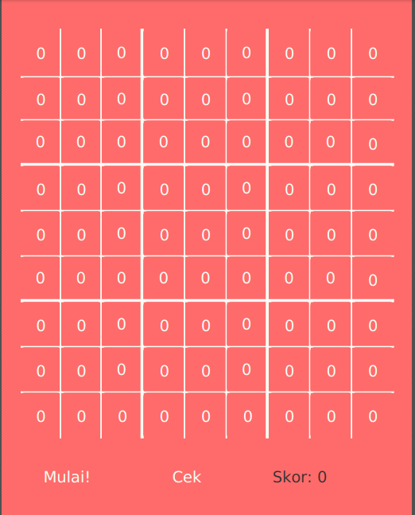

# ID

# Sudoku di Java
Sebuah permainan Sudoku yang dibuat dengan Java dan JavaFX.

## Fitur
- Skor dan progress bar yang akan terisi berdasarkan jumlah angka yang benar
- Fitur untuk memeriksa berapa banyak angka yang benar
- Tombol untuk mengulang dan mengganti papan Sudoku secara acak

## Tangkapan Layar
- **Tampilan Utama**  
  

- **Tampilan Sebelum Memulai**  
  

- **Tampilan Setelah Memulai**  
  

- **Tampilan Setelah Pengecekan**  
  

# EN
# Sudoku in Java
A Sudoku game built using Java and JavaFX.

## Features
- Score and progress bar that fill based on the number of correct digits
- Check how many numbers are correctly placed
- Button to restart and randomize the Sudoku board

## Screenshots
- **Main Interface**  
  

- **Before Starting**  
  

- **After Starting**  
  

- **After Checking**  
  

